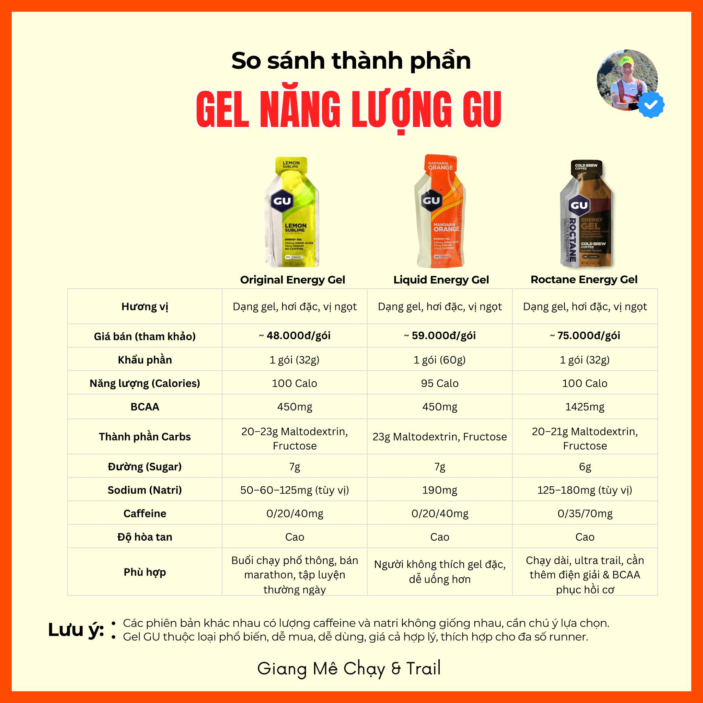
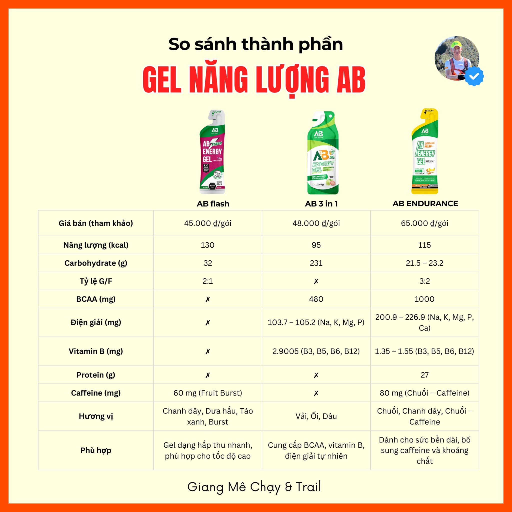
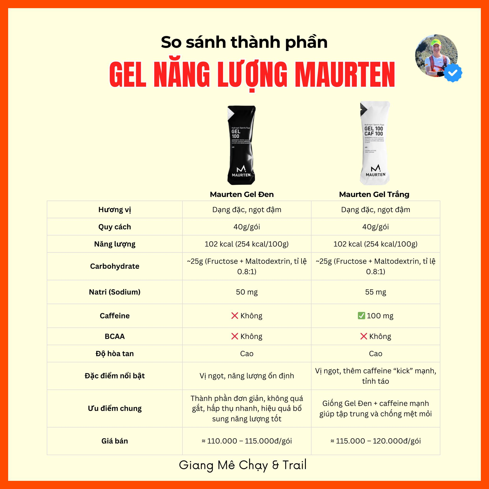
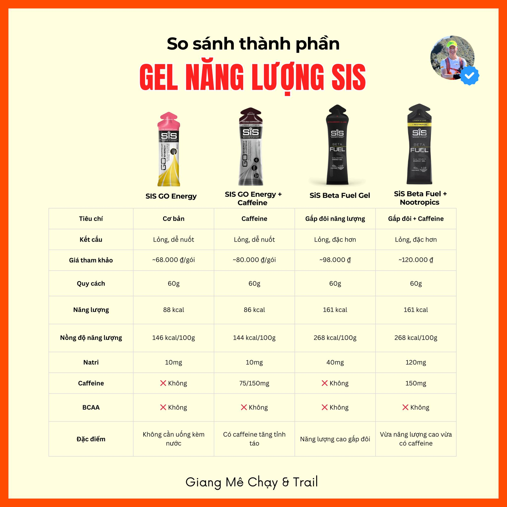
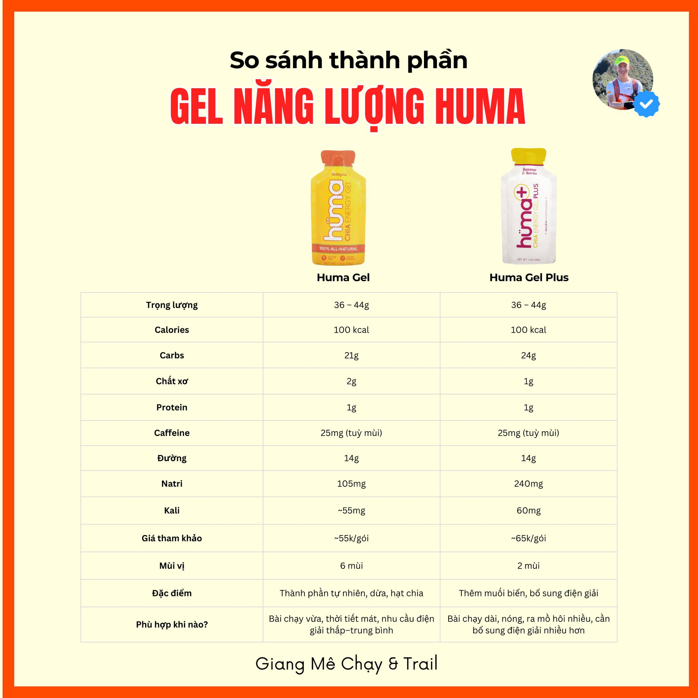
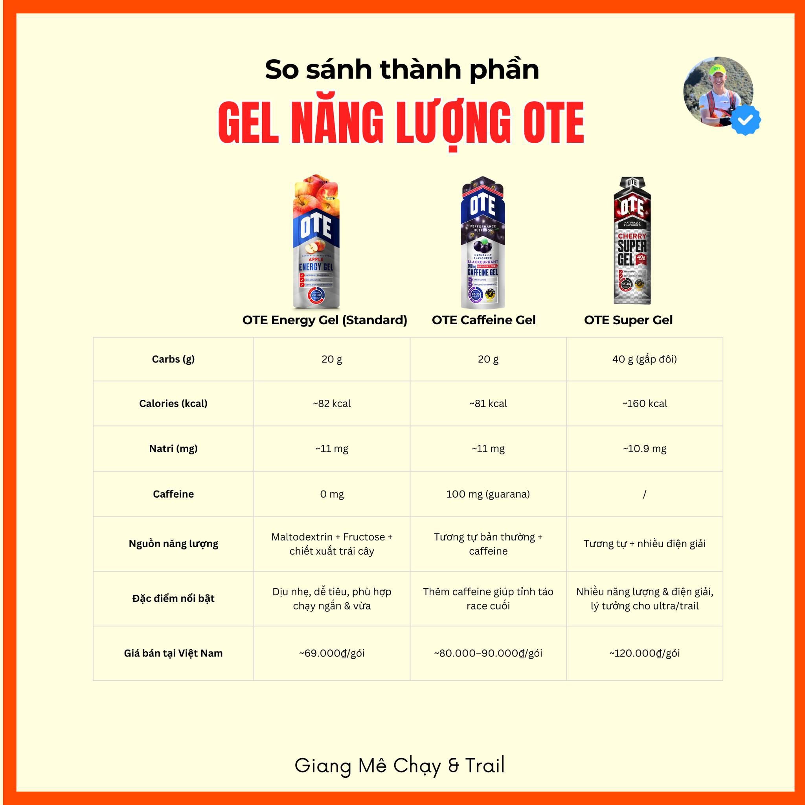
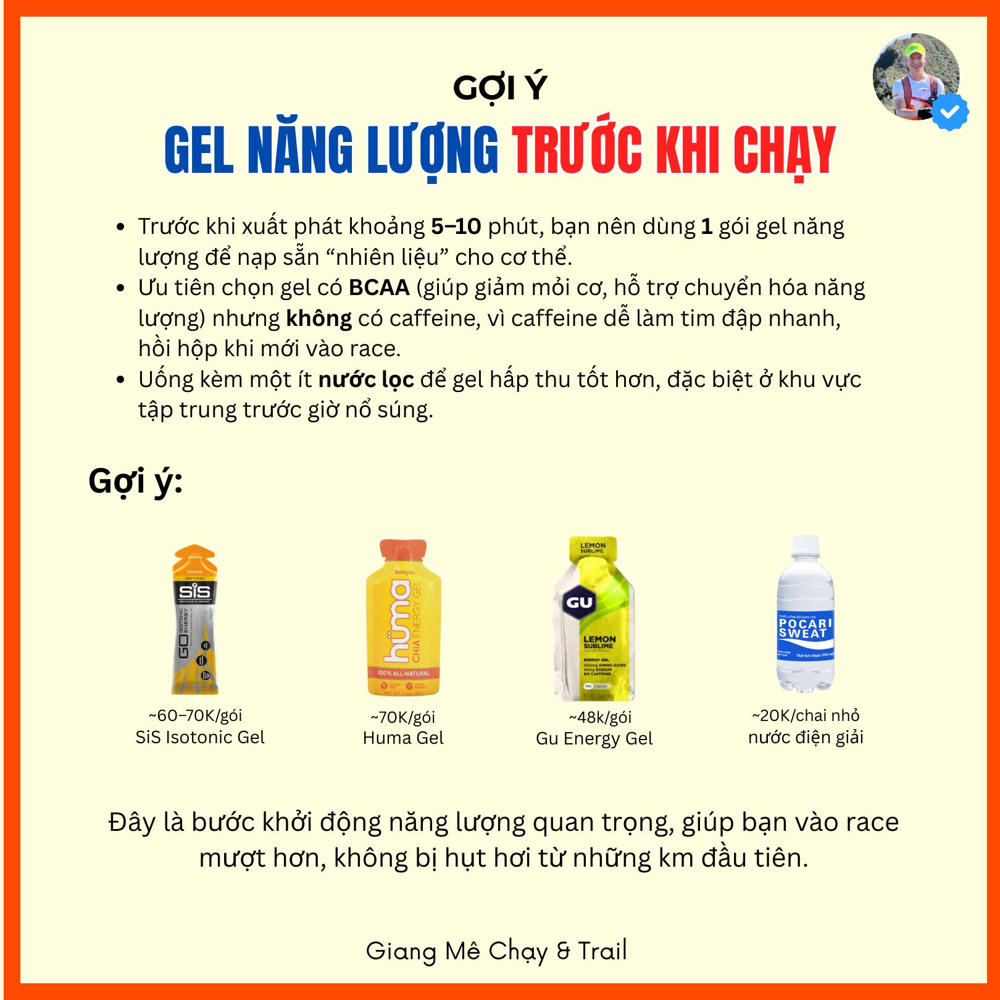

# GEL NĂNG LƯỢNG & 5 ĐIỀU RUNNER HAY HỎI NHẤT ⚡

**Giang Mê Chạy giải đáp hết** 👇

Anh em runner chắc ai cũng từng cắn một gói gel trên đường chạy rồi nhỉ. Nhưng gel thực sự có gì mà quan trọng thế? Hôm nay Giang mê chạy chia sẻ 5 thắc mắc kinh điển nhé 👇

---

## 📍 PHẦN 1: 5 Điều Runner Hay Hỏi Nhất

### 1. Tại sao phải ăn gel?

Cơ thể mình chạy bằng "xăng kép": đường và mỡ. Mỡ thì nhiều lắm, vô tận luôn, nhưng glycogen (đường) thì ít ỏi. Mà càng chạy nhanh, càng leo dốc, cơ thể càng đốt nhiều đường. Qua zone 3 là đã hơn 50% năng lượng từ đường rồi. Không bổ sung → sớm muộn cũng "hết pin". Vậy nên gel chính là cách đơn giản nhất để tiếp thêm đường – tiếp thêm sức.

### 2. Ăn chuối hay chocolate thay gel được không?

Ừ, cũng có đường đấy, nhưng kèm theo chất béo, đạm, xơ → tiêu hóa lâu, tăng gánh nặng dạ dày → đường vào máu chậm, lúc cần thì không kịp. Trong race, từng phút từng giây quan trọng, nên gel với thành phần tinh gọn mới là lựa chọn số 1.

### 3. Khi nào ăn, ăn bao nhiêu?

Đừng chờ "hết pin" mới nạp. Gel cần thời gian để hấp thu → ăn sớm, chia nhỏ, đều đặn.

- **Cường độ thấp**: khoảng 50g đường/giờ, 1 chai nước thể thao là đủ tối thiểu.
- **Cường độ cao hơn**, chạy nhanh, leo dốc → phải nạp nhiều hơn.
- **Nguyên tắc**: gắng sức càng nhiều, gel càng phải đủ.

### 4. Gel đắt với gel rẻ khác nhau thế nào?

Thật ra chỉ khác loại đường và hương vị.

- Đường chuỗi dài → hấp thu chậm, nhẹ bụng.
- Đường chuỗi ngắn → hấp thu nhanh, ngọt, dễ đầy bụng.

Cuối cùng thì 1g đường vẫn = 4 kcal. Với runner phổ thông → cứ nạp đủ lượng đã đạt 90% hiệu quả. Còn 10% "sang xịn mịn" thì không quyết định nhiều đâu.

### 5. Tự làm gel được không?

Hoàn toàn được! Nguyên liệu chính maltodextrin rẻ bèo, thêm tí vitamin, hương liệu, bao bì. Nhưng vấn đề là khó bảo quản, vị không ngon. Trong khi gel bán sẵn giá cũng phải chăng, tiện và an toàn hơn nhiều.

> 👉 **Kết lại:** Dù gel rẻ hay đắt, thương hiệu nào đi nữa thì nhớ một điều: **ăn đủ – ăn đúng thời điểm** mới là chìa khóa để hoàn thành đường dài an toàn, hiệu quả.

---

## 📍 PHẦN 2: Chọn Gel Thế Nào Cho Chuẩn? (9 Yếu Tố)

### 1. Thời gian sử dụng
- ➖ **Trước race**: 1 gel có BCAA, không caffeine.
- ➖ **Trong race (nửa đầu)**: Cứ 10km 1 gel, ăn kèm nước để hấp thu tốt.
- ➖ **Nửa sau chặng**: Bổ sung gel có caffeine (tỉnh táo, tăng hiệu suất, giảm cảm giác mệt).

### 2. Tính di động & thân thiện môi trường
Gel càng gọn nhẹ càng dễ mang. Một số hãng còn có bao bì thân thiện môi trường.

### 3. Độ dễ tiêu thụ (độ đặc & hương vị)
- Gel đặc → dễ "dính họng", cần uống nhiều nước.
- Gel lỏng → dễ nuốt, hấp thu nhanh hơn.
- 👉 Nên test trước trong tập luyện để chọn vị hợp khẩu vị.

### 4. Có chứa caffeine hay không?
- **Có caffeine**: giúp tỉnh táo, bứt tốc cuối race.
- **Không caffeine**: an toàn hơn cho dạ dày, tim mạch.
- 👉 Dùng loại không caffeine ở đầu race, có caffeine ở nửa sau.

### 5. Khoáng chất (điện giải)
Natri, kali, magie… cực quan trọng để tránh chuột rút, mất cân bằng điện giải.

### 6. Vitamin
Một số gel bổ sung vitamin nhóm B hoặc C hỗ trợ chuyển hóa năng lượng, chống oxy hóa.

### 7. Axit amin (BCAA)
Giúp giảm mỏi cơ, hỗ trợ hồi phục. Ai hay chạy cự ly dài (FM, ultra) thì nên ưu tiên loại có BCAA.

### 8. Năng lượng (kcal)
Mỗi gel thường dao động 80–120 kcal (tương đương 20–30g carb).
- 👉 Quan trọng nhất: ăn đủ tổng lượng carb/giờ (30–60g cho half, 60–90g cho full).

### 9. Giá cả
- ➖ Gel nội địa: khoảng 40–65k/gói.
- ➖ Gel nhập: dao động 50–160k/gói.
- 👉 Chọn loại hợp túi tiền và ăn đủ số lượng quan trọng hơn là chạy theo thương hiệu.

---

## 📍 PHẦN 3: 6 Loại Gel Năng Lượng Phổ Biến

### 🟡 GU Energy Gel

### 🟢 AB Energy Gel

### ⚫ Maurten Gel

### 🔵 SIS Gel

### 🟠 Huma Gel

### 🔴 OTE Gel

---

## 💡 Gợi ý: Gel trước khi chạy

> **Tóm lại:** Chọn gel không chỉ dựa vào thương hiệu mà phải dựa vào mục tiêu, cơ địa, và cả chiếc ví của mình. Hãy test thử trong tập, tìm ra "người bạn đồng hành" hợp nhất, để khi vào race chỉ việc xé gel và… bay thôi! 🚀