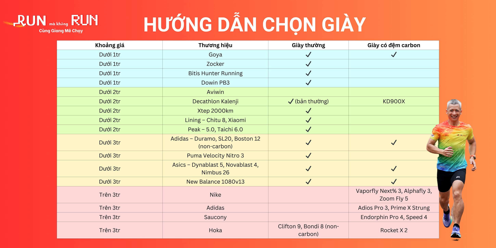
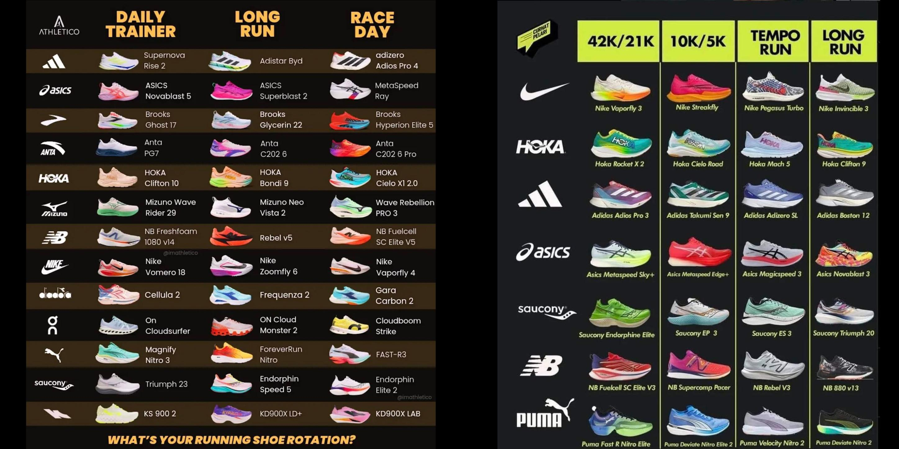
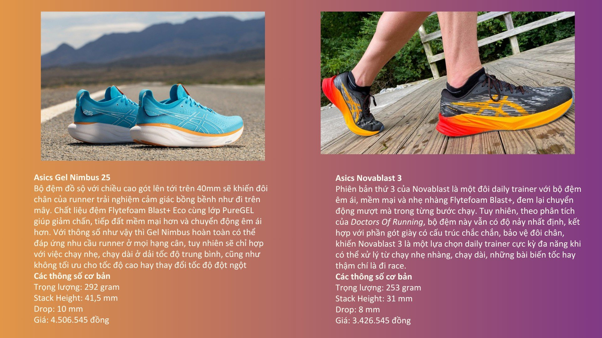
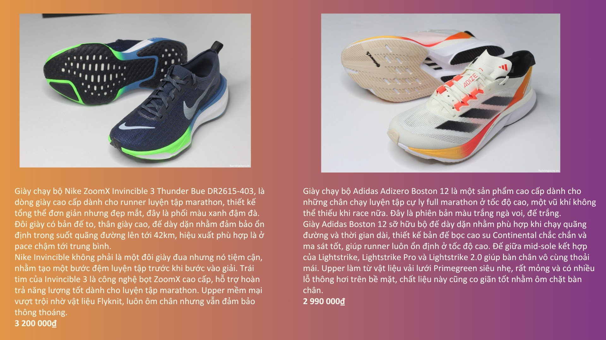
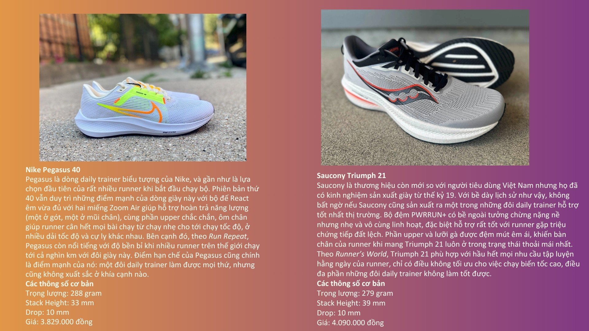
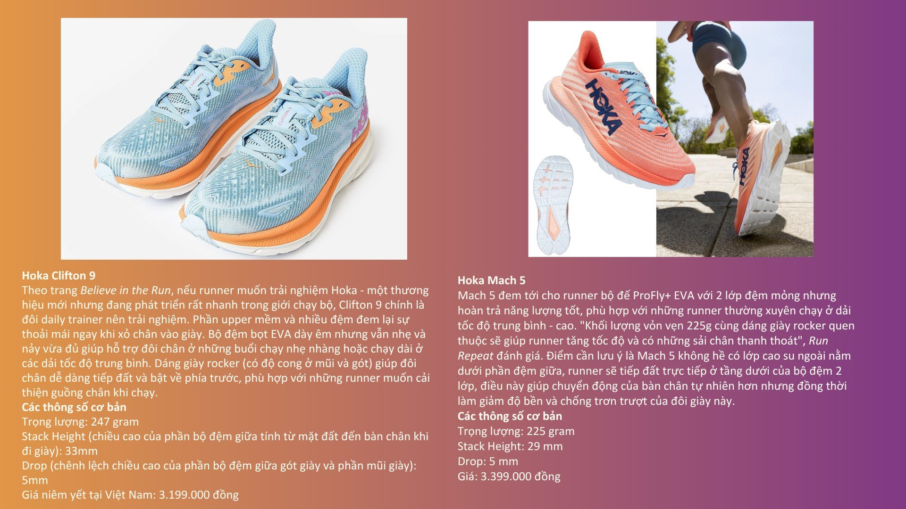
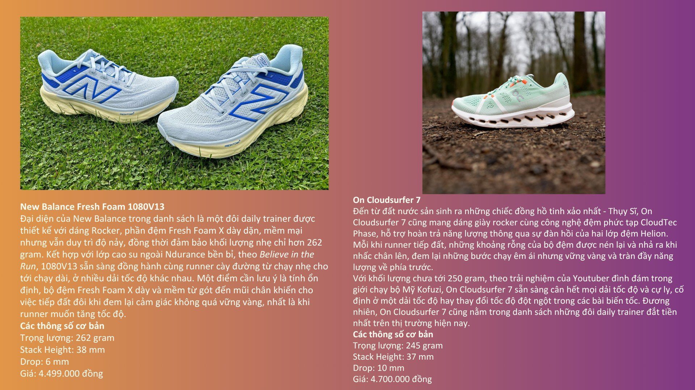
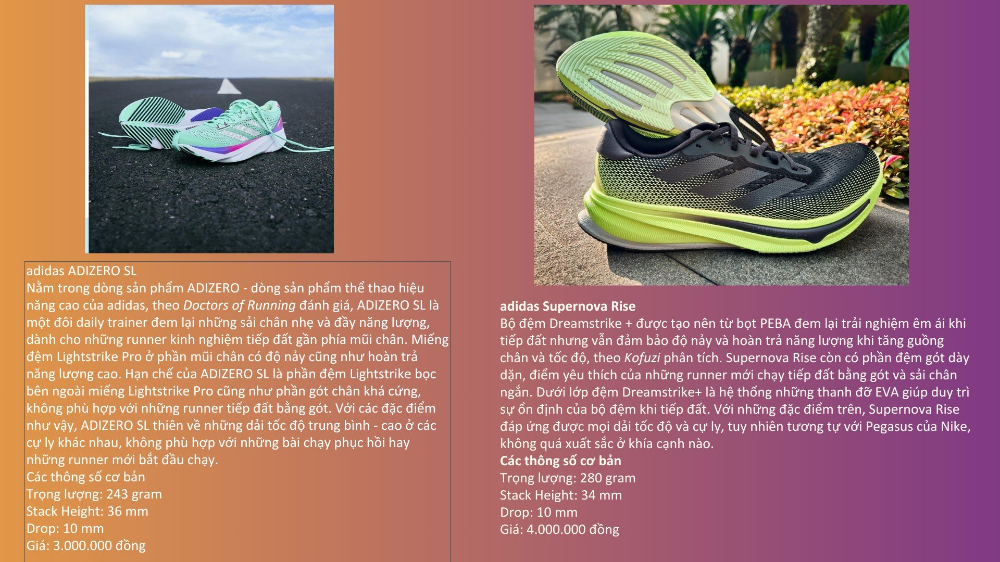

# HƯỚNG DẪN CHỌN GIÀY CHẠY BỘ 🏃‍♂️🔥

Chào anh chị em lớp mình,
Giang biết nhiều bạn đang băn khoăn về việc chọn giày chạy bộ, đặc biệt là trong giai đoạn luyện tập. Sau khi tìm hiểu và tổng hợp, Giang chia sẻ lại thông tin để mọi người tham khảo nhé!

---

## ✅ Nguyên tắc chọn giày

- **Phù hợp nhu cầu và kinh tế** – Không cần đua theo giày đắt tiền nếu mới luyện tập.
- **Nên có 2 đôi để thay đổi** – Giúp giày bền hơn và chân được nghỉ ngơi.
- **Giai đoạn tập luyện** – Có thể dùng giày đế thường (không carbon), hơi nặng một chút cũng được, để chân khỏe và tăng sức bền.

## ⚡ Giày carbon có phù hợp với tất cả?

- Carbon giúp tiết kiệm năng lượng và tăng tốc, nhưng **không bắt buộc** cho giai đoạn tập luyện cơ bản.
- Giày thường rẻ hơn, bền, tốt cho chân khỏe và ổn định form.

---

## 📊 Bảng tổng hợp chọn giày theo khoảng giá

## 🔄 Shoe Rotation & Giày theo cự ly

---

## 🏅 Review chi tiết từng đôi giày

### Asics Gel Nimbus 25 & Asics Novablast 3

### Nike ZoomX Invincible 3 & Adidas Adizero Boston 12

### Nike Pegasus 40 & Saucony Triumph 21

### Hoka Clifton 9 & Hoka Mach 5

### New Balance Fresh Foam 1080V13 & On Cloudsurfer 7

### Adidas Adizero SL & Adidas Supernova Rise

---

Anh chị em có thể tham khảo danh sách này để lựa chọn phù hợp với nhu cầu và ngân sách nhé!

**Giữ lửa, giữ form, giữ chân luôn khỏe!** 💪
