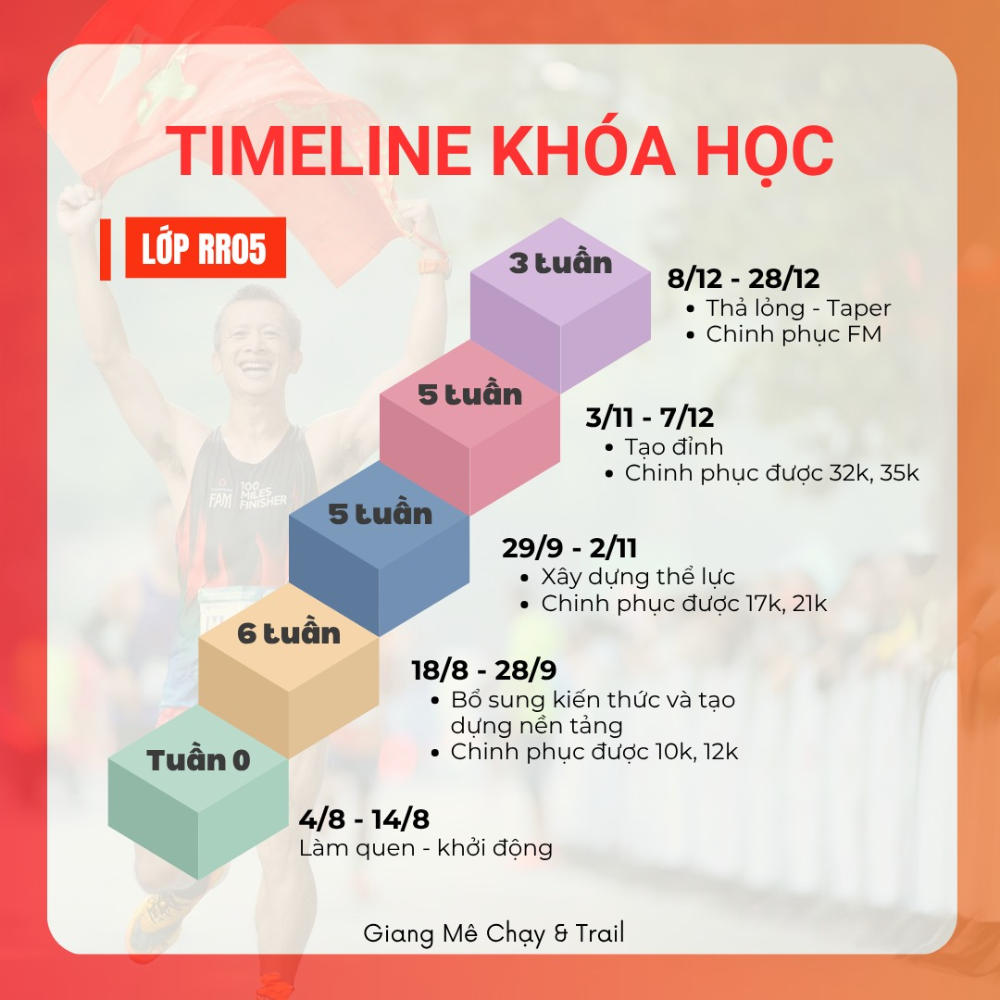

# TIMELINE KHÓA HỌC 🏃‍♂️📆

**Lớp RR05 — Giang Mê Chạy & Trail**

> Chạy đúng cách = Sức bền đỉnh cao + Tinh thần kỷ luật + Cơ thể khỏe mạnh toàn diện!

Chào mừng các chiến binh của "Run mà không run" đã chính thức gia nhập đường đua **AN - BỀN - CHẤT**! Hôm nay Giang xin chia sẻ chi tiết timeline của khóa học để anh chị em chuẩn bị tinh thần, lên dây cót lăn xả từ hôm nay luôn nhé! 💪

---

## 📆 Timeline tổng quan

---

## 🔥 GIAI ĐOẠN 1 – CHẠY ABC, AN BỀN CHẤT (10 tuần)

**Mục tiêu: Từ 0 đến 21KM — Dựng gốc rễ, xây nền vững chãi!**

### Tuần 0: Làm quen (4/8 – 14/8)
- Giang không bắt chạy ngay, mà bắt... làm bạn với giáo án, cách học, Strava, đồng hồ đo.

### 6 tuần đầu: Bổ sung kiến thức, tạo nền tảng (18/8 – 28/9)
- Bổ sung kiến thức, tạo nền tảng vững chắc
- → **Chinh phục 10k – 12k** một cách nhẹ nhàng mà vui vẻ

### 5 tuần sau: Xây dựng thể lực + tinh thần (29/9 – 2/11)
- Xây dựng thể lực + tinh thần
- → **Chinh phục 17k – 21k** không hề xoắn

---

## 🔥 GIAI ĐOẠN 2 – PHÁ BỎ GIỚI HẠN (8 tuần)

**Mục tiêu: Vượt rào cản — Về đích Full Marathon đầu đời!**

### 5 tuần: Tạo đỉnh (3/11 – 7/12)
- Đẩy thể lực, tăng sức bền dẻo dai
- → **Chinh phục 32k – 35k**, gọi tên giấc mơ FM

### 3 tuần cuối: Taper (8/12 – 28/12)
- Thả lỏng – chuẩn bị tinh thần và cơ bắp
- → Lên đồ chốt sổ: **Chinh phục FM – 42KM** huy hoàng! 🏆

---

## 🎯 MỖI TUẦN HỌC GÌ?

### ✅ ĐẦU TUẦN
- Nhận **video hướng dẫn** chi tiết – Học mọi lúc mọi nơi
- Nhận **giáo án cá nhân hóa**, đúng cường độ, đúng mục tiêu

### ✅ TỐI THỨ 5
- **Zoom coaching** cùng Giang
- → Chữa lỗi chạy, giải đáp vướng mắc, tiếp năng lượng chống bỏ cuộc

### ✅ TRONG TUẦN
- Thực hành theo giáo án
- Tracklog qua **Strava & đồng hồ**, update bài hàng ngày lên nhóm lớp

### ✅ CUỐI TUẦN
- Viết bài chia sẻ cảm nhận, nhìn lại hành trình, kết nối cùng cộng đồng runner chiến binh

---

💥 Đây không chỉ là khóa học chạy bộ. Đây là hành trình trưởng thành – thay đổi – và bứt phá chính mình. Giang dặn trước là trái ngọt không tự nhiên mà có, phải vun trồng, kiên trì mỗi ngày anh chị em nhé!

Hẹn gặp các bạn trên Zoom thứ 5 tuần tới nhé! 🎯